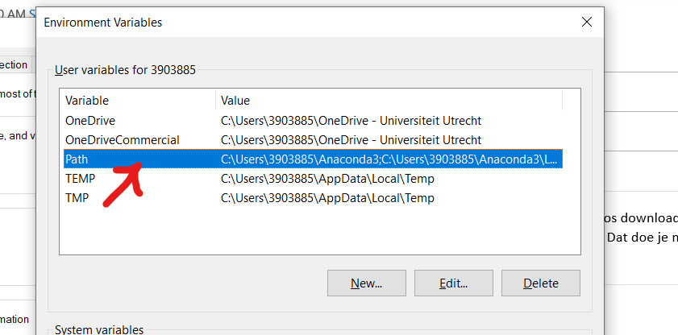
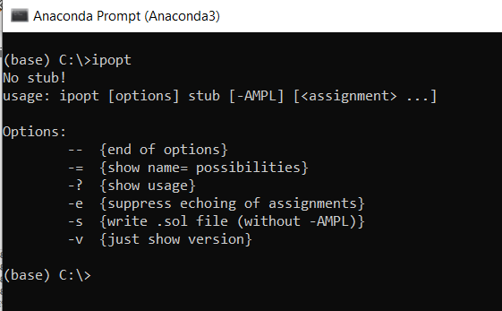

# Installing MIMOSA

MIMOSA is written in Python, can be installed using `pip`:
```bash
pip install mimosa
```

If you don't have Python installed yet, we highly recommend to use [Anaconda](https://www.anaconda.com/download) to install python. 

## Installing the optimisation engine IPOPT

Since MIMOSA is an optimisation model, an optimisation engine needs to be specified. This can be installed locally (see [With IPOPT installed locally](#with-ipopt-installed-locally)), but an easier way is to use a free cloud-based optimisation service called NEOS.


=== "Using the NEOS server"

    The MIMOSA runs can easily be sent to the NEOS server (<https://neos-server.org>) for remote optimisation. First, on their website, sign up for a free account. You can then run MIMOSA with NEOS enabled by simply providing it with the email address you used to sign up for NEOS:

    ```python
    from mimosa import MIMOSA, load_params

    params = load_params()

    model1 = MIMOSA(params)
    model1.solve(use_neos=True, neos_email="your.email@email.com")
    model1.save("run1")
    ```

    Depending on the MIMOSA parameters chosen and on how busy the NEOS server is, running the model might take a while (typically a couple of minutes).

=== "With IPOPT installed locally"

    A faster way to run MIMOSA, and which doesn't require an internet connection, is to install the open-source optimisation engine IPOPT locally:
    ```
    conda install -c conda-forge ipopt
    ```
    However, this sometimes fails on Windows. To fix it, go to <https://www.coin-or.org/download/binary/Ipopt/> and download the latest win64-version. Unzip the files. A subfolder `bin` should contain the file `ipopt.exe`. The next step is to add this folder to your PATH environment:
    Windows > Edit the system environment variables > Environment variables... > Select "Path" and click Edit... > Click New and browse to the folder you just unzipped. Make sure to select the `bin` subfolder as this folder contains the file `ipopt.exe`.

    ??? info "More detailed steps on how to install IPOPT on Windows"

        1. Once you've downloaded the zip file of the latest win64-version on the coin website (currently `Ipopt-3.11.1-win64-intel13.1.zip`),
        unzip this file to folder of your choice. In the unzipped folder, there should be a `bin` folder.
        2. The next step is to tell Windows to look for IPOPT in this `bin` directory. This is achieved by adding the relevant folder to the *environment path* of Windows. Click on Start (or press the ++win++ key), type `environment` and press ++enter++. This should open the dialog `Edit the system environment variables`.
        3. Click on `Environment variables`, select `Path` and click edit.<br><br><br><br>
        4. Here, you can add the folder with the IPOPT bin folder. Click on New and add the folder you unzipped IPOPT in, making sure to select the sub-folder `bin`:<br><br><br><br>
        5. You can test if everything works by opening an Anaconda Prompt and typing `ipopt`. It should show something like this:<br><br><br><br>

    Once IPOPT is installed, MIMOSA can be ran without NEOS:
    ```python
    from mimosa import MIMOSA, load_params

    params = load_params()

    model1 = MIMOSA(params)
    model1.solve()  # No NEOS required
    model1.save("run1")
    ```

[Next: Running MIMOSA :octicons-arrow-right-24:](run.md){.md-button}